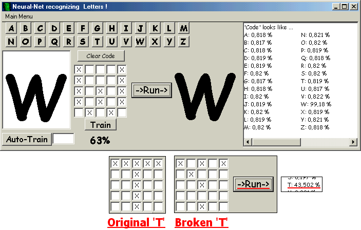



## Neural Net \- recognizing Letters

### Description

With this Code you can teach a Neural Net (=NN) , how the A-B-C looks like and make it recognize them! For every Letter there is 'Picture' (=5x5-"Pixels")! You teach your NN this Picture to the Letter you want it to! (What means: you can even tell your NN that a 'F' looks like a 'W' or whatever)

After teaching the NN the Letters, you can make (f.e.) a 'Picture' (= Letter-Code) that looks NOT EXACLTY the same as an "F" an the Neural Net will tell you that your NOT-EXACLTY-the-same-"F" looks mostly like an "F" ! =)

Modify pre-Definded-Letter-Codes in ... "\Data\Letter_Codes.txt"

Credits: This code is based on 'Paras Chopra' Neural-Net Tutorial ! you also find it here on planet-source-code.com
 
### More Info
 

             |
---                |---
**Submitted On**   |2005-06-20 16:38:32
**By**             |[alekto](https://github.com/Planet-Source-Code/PSCIndex/blob/master/ByAuthor/alekto.md)
**Level**          |Intermediate
**User Rating**    |4.8 (24 globes from 5 users)
**Compatibility**  |VB 6\.0
**Category**       |[Complete Applications](https://github.com/Planet-Source-Code/PSCIndex/blob/master/ByCategory/complete-applications__1-27.md)
**World**          |[Visual Basic](https://github.com/Planet-Source-Code/PSCIndex/blob/master/ByWorld/visual-basic.md)
**Archive File**   |[Neural\_Net1903876202005\.zip](https://github.com/Planet-Source-Code/alekto-neural-net-recognizing-letters__1-61258/archive/master.zip)

